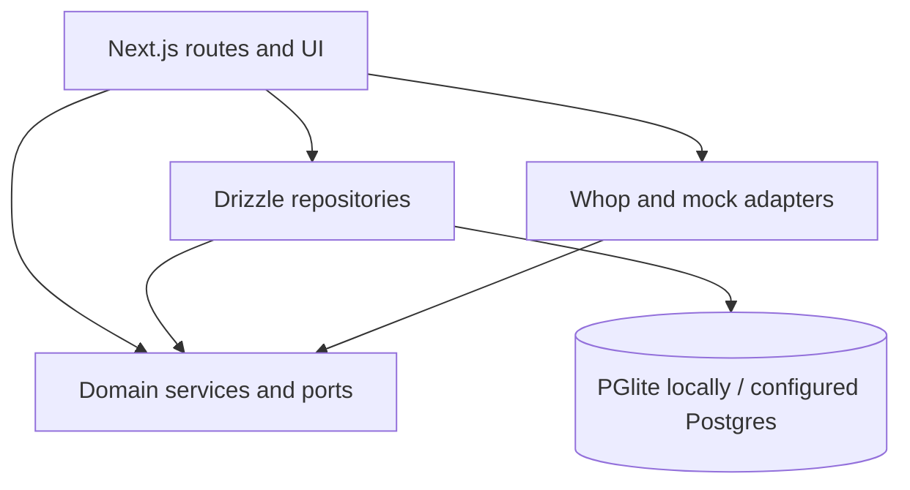
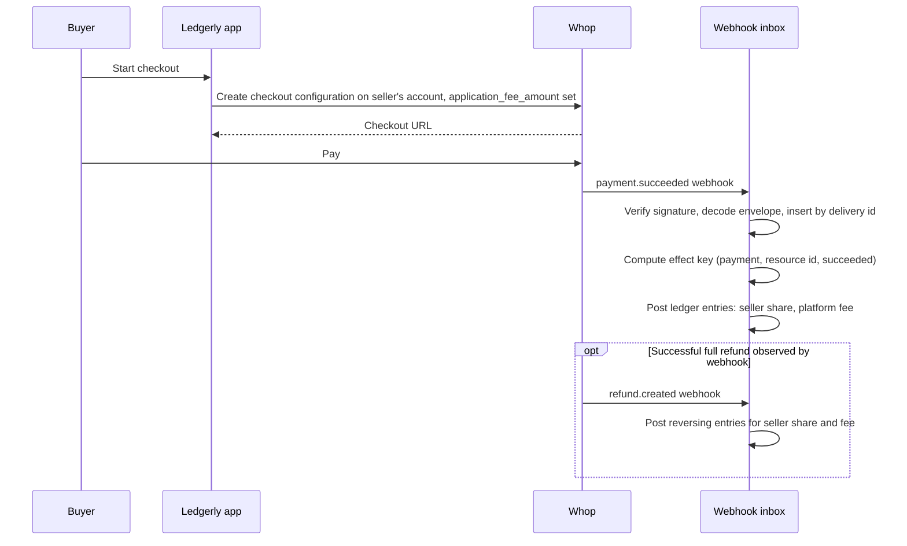

# Ledgerly assessment

Ledgerly is a fictional creator marketplace that takes an 8% platform fee. This source export includes buyer checkout, seller onboarding and earnings, operator recovery, signed webhook processing, reconciliation, and a local demo with persistent PGlite and a mock Whop provider.

## Run locally without provider credentials

Use Node.js 24 or newer and the pinned `pnpm@12.3.4`. The repository includes the exact dependency lockfile and the required Next.js patch.

```sh
pnpm install --frozen-lockfile
pnpm dev:mock --port 4498 --data-dir "$PWD/.local-runtime/demo"
```

Open `http://127.0.0.1:4498`. Use the exact loopback address, not `localhost`. The launcher generates local signing secrets in memory, applies the PGlite schema, seeds fictional sellers/products, and uses only the mock provider. It refuses deployment environments and dotenv files. Do not copy `.env.example` for this quickstart.

If using an extracted archive instead of a Git clone, initialize a new local repository first so the existing runtime can report its own revision:

```sh
git init
git add .
git -c user.name="Local reviewer" -c user.email="reviewer@example.test" commit -m "Import assessment source"
```

The sample profile routes are `/demo/profile/buyer`, `/demo/profile/seller`, and `/demo/profile/operator`. The operator profile is restricted; `/api/local-runtime/operator` creates the local test operator. `/demo/start` opens the guided product flow. `/handoff/scenarios` runs four separately labeled in-memory assessment scenarios. Use Ctrl-C to stop. Reuse the data directory to retain state, or choose a new directory for a new isolated database. Never share these local sample credentials or generated sessions with a deployed environment.

## Check the source

```sh
pnpm test
pnpm typecheck
DEMO_MODE=1 WHOP_MODE=mock pnpm build
node --test scripts/local-runtime/test/launcher.test.mjs
```

These are local source, adapter-fixture and PGlite checks. No configured provider credentials are required. Captured-provider suites and private presentation/archive checks are excluded; see `EXPORT-NOTES.md` for the exact boundary. This export does not inherit a private Linux CI pass.

## Assessment answers

The requested implementation lives in these files:

| Requirement | Implementation |
| --- | --- |
| Idempotent seller onboarding | `packages/core/src/services/onboarding.ts`, persisted operation and seller repositories |
| Checkout with validated 8% fee | `packages/core/src/fee.ts`, `packages/core/src/services/orders.ts` |
| Signed, durable webhook consumer | `packages/whop/src/webhooks.ts`, `packages/core/src/services/inbox.ts`, `packages/db/src/repos/repositories.ts` |
| Seller reconciliation | `packages/core/src/services/reconciliation.ts`, `apps/web/src/app/api/cron/sweep/route.ts` |
| Both money-flow diagrams | Below |
| Debugging answer | [Original approved Part 3 answer](docs/answers/debug.md) |

Part 1 operations requiring actual Whop accounts are not performed by this export. The local scenarios illustrate onboarding refusals/states, full refund allocation reversal, platform hold/release/transfer, and eight webhook envelopes. The product has separately labeled sample payout requests. These do not prove completed identity verification, bank settlement, successful provider refund/transfer, or receipt of all eight actual provider event types. Raw provider responses, personal email aliases, real account IDs and private recordings are excluded.

Customer Loom: I will add that soon.

Three proposed documentation improvements from the assessment's dated review are to make the application-fee checkout endpoint unambiguous, clarify whether connected-account parentage comes from the authenticating key or a request field, and define whether `child_resource_events` includes parent events and nested children. These are historical proposals, not newly verified statements about current Whop documentation.

## Architecture



The core owns integer minor-unit money, fees, onboarding, business-effect deduplication and reconciliation. Database adapters persist operations, inbox deliveries and ledger entries. Provider adapters decode responses and attach provenance. Reconciliation reports drift; it does not invent repairs. Local payment completion sends a signed mock event through the real inbox and verifies the resulting stored order state.

## Money flow 1: direct charge

The seller's own connected account takes the charge. Ledgerly's cut is collected as an application fee on that same charge.



## Money flow 2: platform charge plus transfer

The buyer pays Ledgerly's own account directly. Ledgerly later moves the seller's share out with a transfer. This flow is used for sellers on `platform_only` sale policy.

```mermaid
sequenceDiagram
    participant Buyer
    participant Ledgerly as Ledgerly app
    participant Whop
    participant Sweep as Cron sweep
    participant Inbox as Webhook inbox
    Buyer->>Ledgerly: Start checkout
    Ledgerly->>Ledgerly: Persist order with flow=platform_transfer and fee
    Ledgerly->>Whop: Create checkout configuration on Ledgerly's own account
    Buyer->>Whop: Pay
    Whop->>Inbox: payment.succeeded webhook
    Inbox->>Inbox: Match existing order by checkout configuration; mark paid
    Note over Sweep,Whop: Select paid orders past the configured creation-time hold, default zero
    Sweep->>Whop: Release transfer for seller's share
    Whop->>Inbox: transfer.completed webhook
    Inbox->>Inbox: Post ledger entries: platform debit, seller credit
```

`packages/core/src/services/orders.ts` computes the fee and stores the order before requesting checkout. A direct order charges the seller account; a `platform_transfer` order charges the platform and retains the fee locally. The payment webhook matches the existing order by checkout configuration and marks it paid.

The sweep wires `packages/core/src/services/transfers.ts` to select paid platform-transfer orders without a transfer ID, submit the seller share with an order-based idempotency key, and record the returned transfer ID. The service accepts a configurable hold, and current server wiring uses its zero-second default. The hold uses order creation time, not payment or provider settlement time. Provider failure remains a failed attempt; the saved sandbox transfer attempts did not succeed. A successful `transfer.completed` event is the later ledger-posting step.

The direct-charge refund diagram describes implemented local reversal of a full refund's allocation. Partial-refund ledger effects are unsupported and quarantined. It does not establish Whop's application-fee refund policy: the saved sandbox refund was rejected, so no provider fee reversal was observed.

## Exactly once

The implemented deduplication uses three stored identifiers. Their scope matters when handling retries:

1. `webhook_inbox`, keyed by delivery id. A duplicate delivery is a no-op.
2. `business_effects`, keyed by resource type, resource id, and transition. Ledger entries only get appended the first time a given effect key is inserted (`packages/core/src/services/inbox.ts`, `packages/db/src/repos/repositories.ts`).
3. `operations`, keyed by our own idempotency key, storing the request, the API version, and the outcome. An unknown outcome gets reconciled later, never retried under a new key.

`packages/core/src/effects.ts` normalizes withdrawal event names to payout names when it builds effect keys. Local tests verify that matching resource IDs and transitions post one effect. This is an implementation policy, not proof that every Whop API version treats the names as interchangeable. The [debugging answer](docs/answers/debug.md) calls for checking the supplied event contract before diagnosing a duplicate posting.


## Optional provider integration and licenses

The normal hosted app requires a separately configured database and purpose-scoped Whop credentials. `.env.example` contains empty credential placeholders only. Mock demo addresses use reserved test domains and are unsuitable for hosted onboarding. No account or key provisioning is part of this export.

The optional embedded balance component references Whop's official hosted Elements script with the source snapshot's integrity hash. Its bytes are not bundled here because the available license notice covered a different npm build. The local mock path does not load that SDK. Provider use and that remote script have not been validated by export checks; a changed upstream script will fail integrity verification until intentionally reviewed. The local payout simulation remains available.

[Third-party notices](THIRD-PARTY-NOTICES.txt) retain the source's WorkOS, Whop and Radix notices. The export contains no project-wide license grant. Publication alone does not establish unrestricted reuse rights; the owner must decide the project license before describing it as open source. Dependency licenses remain with their packages. The Whop name and other marks are not granted a trademark license by this export.
