# Ledgerly

Ledgerly is a fictional creator marketplace built on the Whop Platforms API. Sellers get a connected account under Ledgerly's platform account. Buyers pay through Whop checkout. Ledgerly keeps 8 percent of every sale and runs its own ledger.

This repo is a reference implementation for the Whop Platforms team. Every id below comes from a real sandbox call. The app is live; click through it and buy things. The last section lists what the sandbox would not do.

## Try it

Money is fake; everything runs against the Whop sandbox. Buy anything with card `4242 4242 4242 4242`, expiry 12/30, CVC 123. The seller and operator links below sign you in as a sample account with one click. No password.

**[Storefront](https://ledgerly-afneymans-projects.vercel.app/)**. Browse, open a product, buy it.

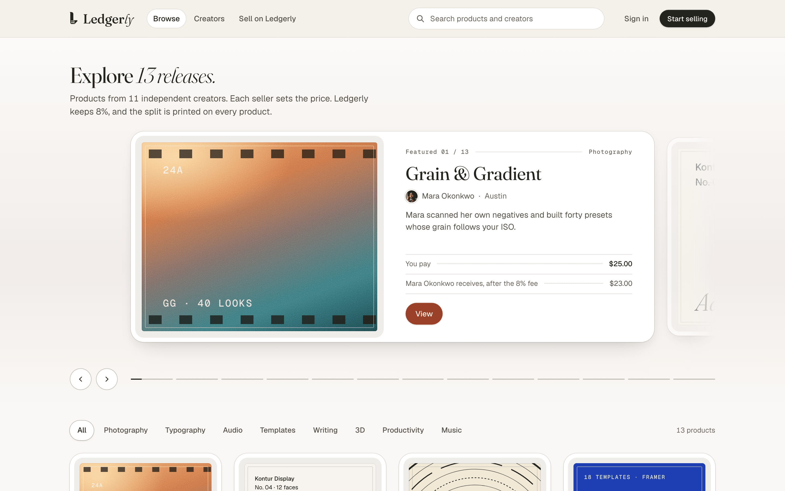

**[Buy a product](https://ledgerly-afneymans-projects.vercel.app/browse)**. Pick anything. The receipt shows the 8 percent split.

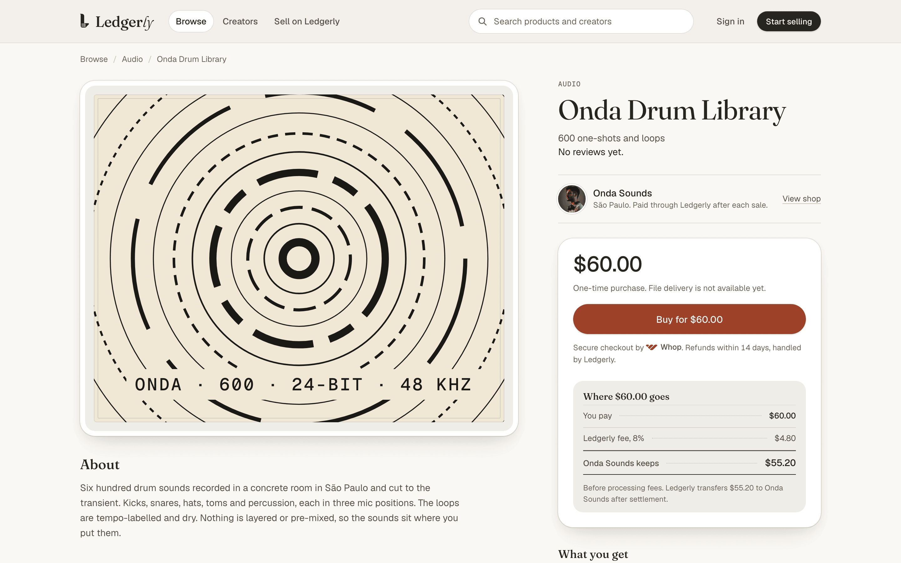

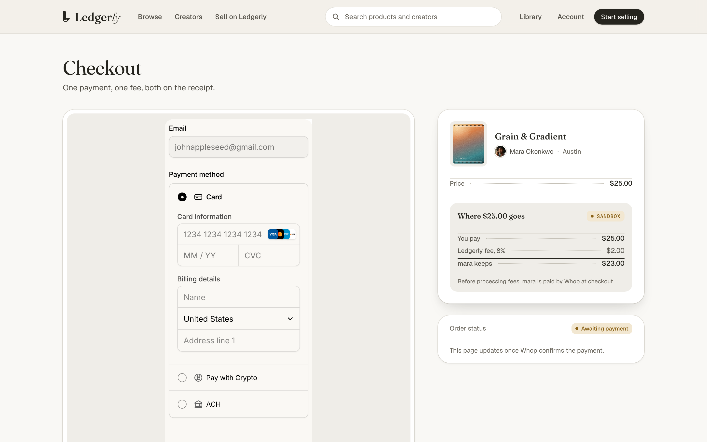

**[Seller earnings and payouts](https://ledgerly-afneymans-projects.vercel.app/demo/profile/seller?next=%2Fsell%2Fearnings)**. Balance, fee lines and the embedded Whop payouts widget.

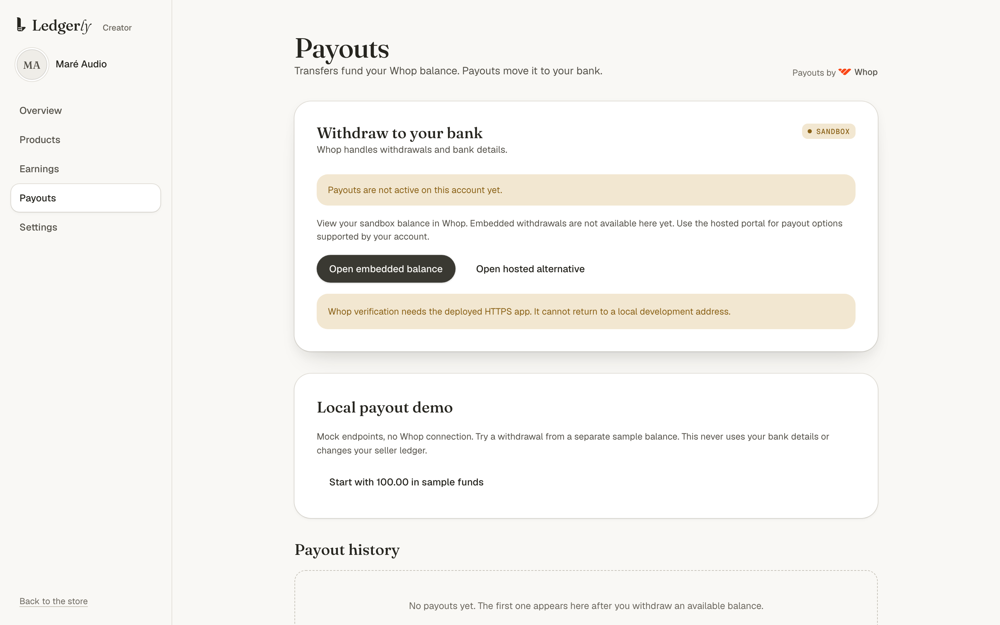

**[Operator dashboard](https://ledgerly-afneymans-projects.vercel.app/demo/profile/operator?next=%2Fadmin%2Fsellers)**. Sellers, the ledger, and issues with one-click resolution.

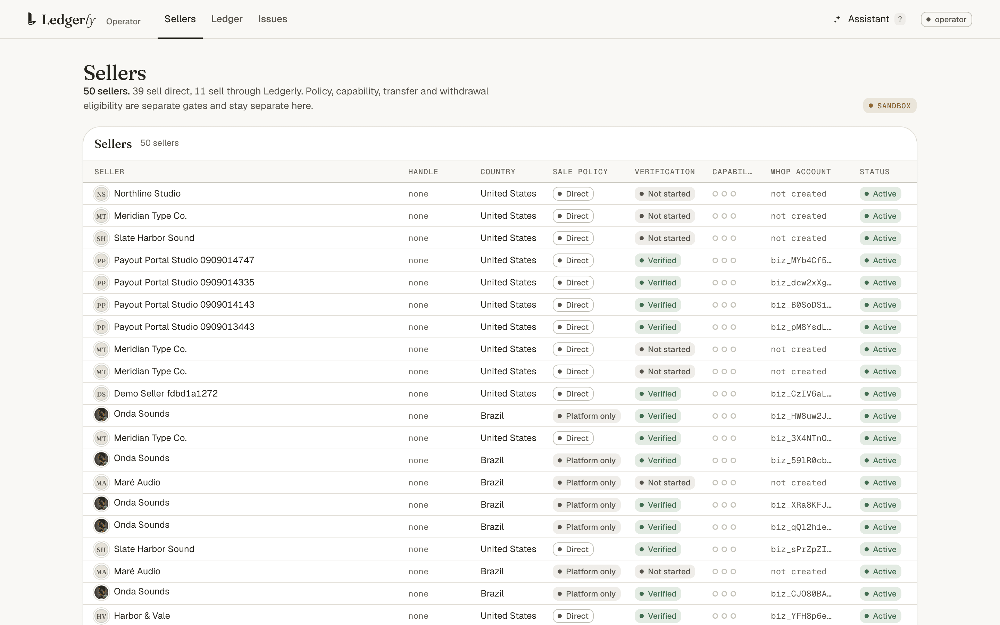

**[Whop store](https://sandbox.whop.com/ledgerly)**. The same products on Whop's own hosted pages.

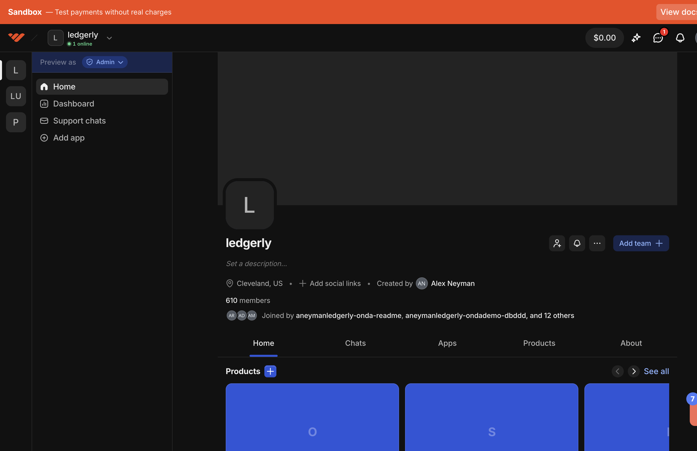

**[Integration Lab](https://ledgerly-afneymans-projects.vercel.app/handoff/lab)**. Customer journeys as browser tests against the real app. Each step keeps its screenshot, video and trace.

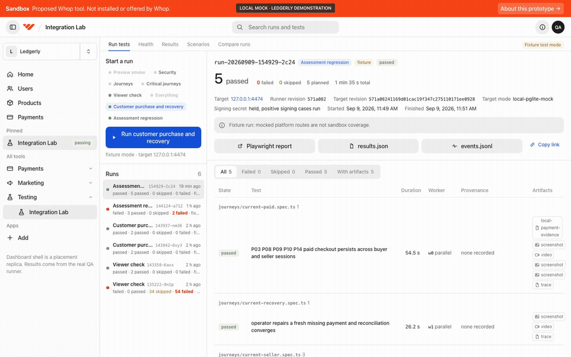

**[Handoff](https://ledgerly-afneymans-projects.vercel.app/handoff)**. Sandbox evidence, browser test runs, scenario simulations and engineering notes.

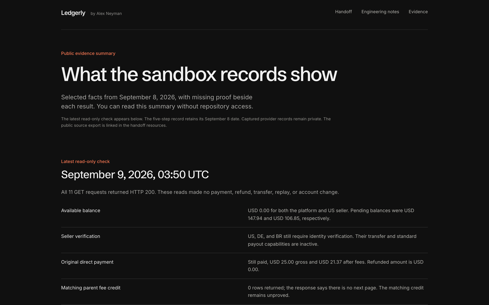

## What the assessment asked, and where it is

The brief is the Whop Platforms FDE assessment. The status of every requirement, with its evidence file, is in [docs/lanes/final-closeout/README.md](docs/lanes/final-closeout/README.md).

### Submission ids

| Item | Id |
|---|---|
| Platform (parent) account | `biz_RlL9WP9TIBVXmr` |
| US connected account | `biz_pt7b2NAryKwRGh` |
| Germany connected account | `biz_fuyI21F4iaNTDu` |
| Brazil connected account | `biz_8dB7THK4woBs43` |
| Direct charge | `pay_ELe6ONlgjrYv5Z`, 25.00 USD, 2.00 application fee |
| Refund of that charge | `rf_AtBJ9mtmOMtikt6`, 25.00 USD |
| Platform charge | `pay_cxvGcm7NvjoCkV`, 60.00 USD |
| Transfer to the Brazil seller | `ctt_XOWIF7fafgGBHX`, 55.20 USD (Whop prefixes transfers `ctt_`, not `trf_`) |
| Webhook | `hook_gO3nsBQBCSyzF`, child events on, eight subscriptions |
| Written answers | [docs/answers/debug.md](docs/answers/debug.md), [docs/answers/improvements.md](docs/answers/improvements.md) |

### Part 1: build it

**1. Platform and connected accounts.** The three accounts above sit under the platform account. Creating a US seller twice, once with the same idempotency key and once with a new one, returned the same account (`biz_m3qw7Bln9ZxZqN`, run d) with HTTP 201 both times. Creating an account with a connected account's key returned 400, "A connected account cannot create its own connected accounts". Evidence: [keys](docs/lanes/final-closeout/keys/README.md), which cites the run d fixtures.

**2. Onboarding.** An `account_onboarding` link for the German seller was created and walked in the hosted flow. After the personal-details form, `verification.individual` moved from `null` to `pending`, the `verify_identity` action changed title, six capabilities became blocked, and `payment_controls.undated_pending_reason` became `kyc_incomplete`. Sumsub accepted a document upload, then asked for a live webcam check. The sandbox has no test path for that step, so verification stops at pending. Before and after readbacks: [onboarding](docs/lanes/final-closeout/onboarding/README.md).

**3. Two money flows.** Direct charge: a checkout configuration on the US seller with an inline plan and `application_fee_amount`, paid through the storefront. The seller ledger shows `payment_gross` +25.00, `application_fee` -2.00 and processing fees, net 21.37. The platform ledger shows `application_fee_payout` +2.00 with the payment id on it. A full refund posted `payment_refund` -25.00 on the seller ledger. The platform kept its 2.00 fee; no reversal row appeared in the twenty minutes after. Transfer: the same item sold on Ledgerly's own account, then `POST /transfers` moved the Brazil seller's 55.20 share from the platform ledger to `biz_8dB7THK4woBs43`. `transfer.completed` arrived once per account. The consumer verified and stored both deliveries, then quarantined them: the transfer was made by hand, so no order carried its id. The sweep path is in the limits section. Top-up is not possible in the sandbox; the midnight UTC settlement funded the transfer instead. Evidence: [money](docs/lanes/final-closeout/money/README.md).

**4. Payouts in Ledgerly's UI.** The seller payouts page mints an access token with five explicit `scoped_actions` and a 5-minute `expires_at`, then renders the embedded payouts components. On 2026-09-08 a 1.5 percent markup was set on the next-day bank withdrawal rail (fee markup `lafm_6IjUzd7WydmlD`, 1.5 percent, `next_day_bank_withdrawal_markup`) and a `payouts_portal` link was created (run d, HTTP 200). Neither was rerun on 2026-09-10; the scoped key lacks those statements. Sandbox payouts cannot complete, so the widget shows the real balance with no payout method.

**5. Webhooks and operations.** One webhook on the platform account, `child_resource_events: true`, all eight required events, pointed at production. The test endpoint was fired once per event type. One real delivery replayed with its original id got `duplicate: true`; replayed with `regenerate_id` it got `duplicate: false` and posted no second ledger effect. One payload per event type is under [webhooks/payloads](docs/lanes/final-closeout/webhooks/payloads): two real deliveries (`payment.succeeded`, `account.updated`), six Whop test bodies. Today's real `refund.created` and `transfer.completed` deliveries are in the [money evidence](docs/lanes/final-closeout/money/README.md). Throwaway account `biz_Z796jyz8aiTHsP` was suspended. A per-seller key for the German seller carries 4 of 231 permission statements: its own account reads 200, a sibling and the platform read 404. Evidence: [webhooks](docs/lanes/final-closeout/webhooks/README.md), [keys](docs/lanes/final-closeout/keys/README.md).

### Part 2: code

| Asked for | Where | Tests | Run |
|---|---|---|---|
| Idempotent onboarding from external id, email, country | [packages/core/src/services/onboarding.ts](packages/core/src/services/onboarding.ts) | [packages/db/test/services/services.test.ts](packages/db/test/services/services.test.ts), [apps/web/test/api/sellers-create.test.ts](apps/web/test/api/sellers-create.test.ts) | `POST /api/sellers` twice with the same body returns the same seller and onboarding link |
| Checkout with the 8 percent fee computed and validated | [packages/core/src/fee.ts](packages/core/src/fee.ts), [packages/core/src/services/orders.ts](packages/core/src/services/orders.ts) | [packages/core/test/core.test.ts](packages/core/test/core.test.ts), [apps/web/test/api/checkouts.test.ts](apps/web/test/api/checkouts.test.ts) | `pnpm --filter @ledgerly/core test` |
| Webhook consumer: Standard Webhooks signature, idempotent on event id across restarts, routed to the seller | [packages/whop/src/webhooks.ts](packages/whop/src/webhooks.ts), [packages/whop/src/envelope.ts](packages/whop/src/envelope.ts), [packages/core/src/services/inbox.ts](packages/core/src/services/inbox.ts) | [packages/whop/test/webhooks.test.ts](packages/whop/test/webhooks.test.ts), [packages/core/test/services/inbox.test.ts](packages/core/test/services/inbox.test.ts), [packages/whop/test/simulator-inbox-integration.test.ts](packages/whop/test/simulator-inbox-integration.test.ts) | `pnpm --filter @ledgerly/whop test` |
| Reconciliation job diffing one seller's payments and transfers against the local ledger | [packages/core/src/services/reconciliation.ts](packages/core/src/services/reconciliation.ts), [apps/web/scripts/reconcile.ts](apps/web/scripts/reconcile.ts) | [packages/whop/test/transfer-reconciliation.test.ts](packages/whop/test/transfer-reconciliation.test.ts), [apps/web/test/scripts/reconcile-format.test.ts](apps/web/test/scripts/reconcile-format.test.ts) | `pnpm reconcile --seller biz_pt7b2NAryKwRGh` or `pnpm reconcile --mock` |
| README with a sequence diagram of both money flows | this file | | |

How the consumer works:

1. Verify the `webhook-id`, `webhook-timestamp` and `webhook-signature` headers over the raw body first.
2. Store every delivery in a Postgres `webhook_inbox` table keyed by delivery id. A duplicate is a no-op, even after a restart.
3. Decode the envelope by `api_version_date`: `account_id` from 2026-08-14 on, `company_id` before. Route the event to the seller that owns that account.
4. Key ledger entries by business effect: resource type, resource id, transition. `withdrawal.*` names map onto `payout.*` before the key is built, so two names for one change post once.

Unknown accounts are quarantined, never guessed. Partial refunds are rejected as `partial_refund_unsupported`.

#### Direct charge

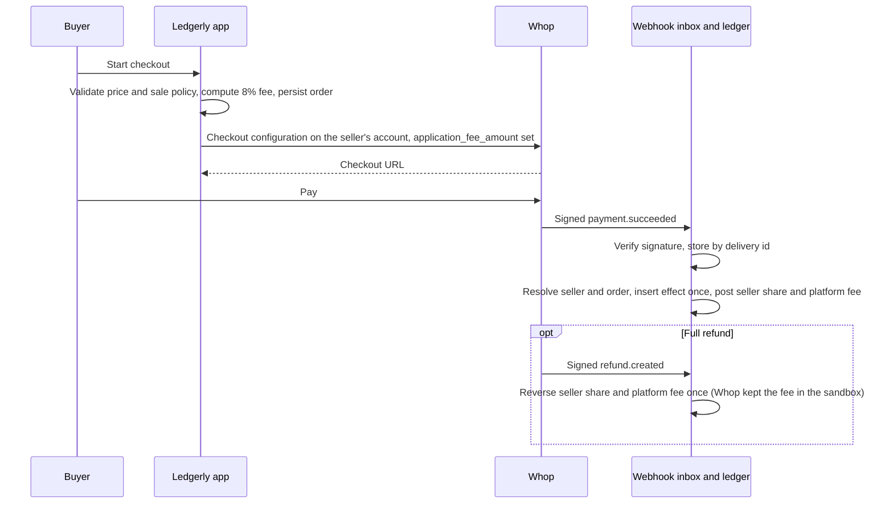

#### Platform charge and transfer

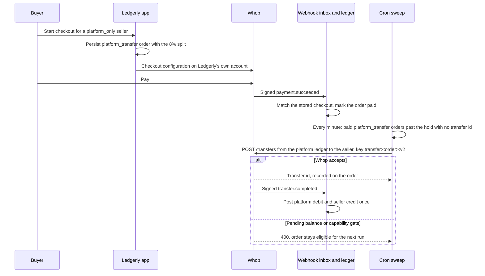

### Part 3: the on-call message

The full answers are in [docs/answers/debug.md](docs/answers/debug.md).

1. No `account_id`: the payload is pinned to `api_version_date: 2026-06-01`, before Whop renamed `company_id` to `account_id` on 2026-08-14. Decode by version, read `company_id` on old pins, never rewrite the payload. Ledgerly's decoder does this.
2. `withdrawal.updated` and `payout.updated` are two names for one transition. Dedupe on a business-effect key after normalizing the name, not on event id. Ledgerly does that mapping before building the key.
3. Two days pending is not a diagnosis. Read the withdrawal by id: status history, rail, expected arrival, verification state, available versus pending funds. Do not retry it.

First reply: "Thanks for flagging this. The consumer expects a newer payload version than that subscription sends, and the double posting comes from two event names for one change. Send the withdrawal id and both webhook event ids. We will read the withdrawal's status history and payout method before promising a date. Do not retry the withdrawal."

### Three things to change first

Long form in [docs/answers/improvements.md](docs/answers/improvements.md).

1. Keep `application_fee_amount` in a documented, current checkout endpoint. The guide uses it on the legacy endpoint; the beta schema omits it.
2. Say how a connected account gets its parent. Examples show `parent_company_id`; the API derives the parent from the key and returns `parent_account`.
3. Define `child_resource_events`: do child events add to or replace parent events, and do grandchildren exist.

## Beyond the assessment

### Integration Lab: the part that scales

An integration is done only while it keeps passing. The Integration Lab is the handoff: the customer journeys (a seller joins and onboards, a buyer pays, the payment lands in the ledger, a refund reverses it, the operator repairs a missing payment) are Playwright tests against the real routes, and every run keeps its evidence. When a customer's engineer changes checkout, they rerun the journey and see the failing step with its screenshot, video, trace, and the app and runner revisions. Nobody has to remember what the integration was supposed to do.


What is in the box:

- The runner and its journeys live in [tests/qa/e2e](tests/qa/e2e/README.md). Fixture mode runs against an isolated PGlite database and the mock provider; hybrid mode runs against the sandbox. Each step records where its data came from.
- [check_required.py](tests/qa/e2e/check_required.py) turns a run into pass or fail over [required-journeys.json](tests/qa/e2e/required-journeys.json). [CI](.github/workflows/ci.yml) runs the same journeys and promotes `release` only when they pass, so production cannot drift from what the tests prove.
- The Lab console (`tests/qa/e2e` in the source tree) is the operator's view: start a journey, watch it, compare two runs, open the report. Reviewers get the published view at [/handoff/lab](https://ledgerly-afneymans-projects.vercel.app/handoff/lab).
- [Engineering notes](https://ledgerly-afneymans-projects.vercel.app/handoff/engineering) list the defects the journeys caught during this build, each with its repair and the test that now guards it.

The pitch to a platform team: hand each customer this runner with their journeys in it, connect it to their CI, and a forward-deployed engineer stops being the memory of the integration. The Lab is built and running for Ledgerly. Extending it to other customers is the proposal.

Full clips: [Integration Lab, 34 s](apps/web/public/demo-clips/final/LAB01-integration-lab.mp4), [operator recovery, 45 s](apps/web/public/demo-clips/final/OP01-operator-recovery.mp4), [buyer and seller tour, 88 s](apps/web/public/demo-clips/final/T01-tour.mp4). All are local recordings against the mock provider.

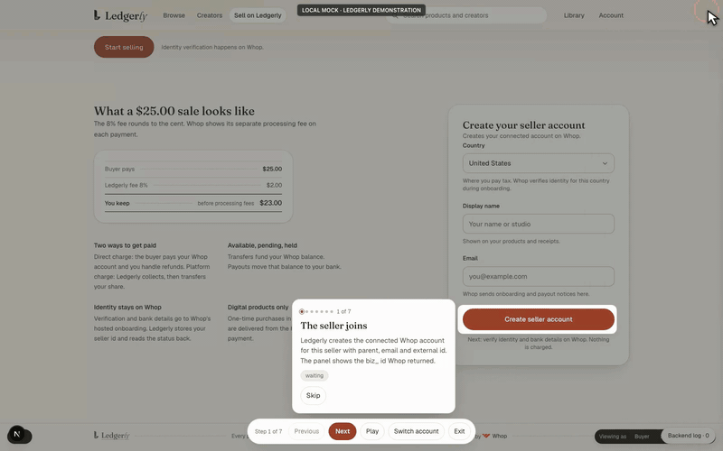

### Evidence portal

The handoff pages publish what ran: sandbox evidence with dates and hashes, isolated scenario simulations for onboarding, refund, transfer and replay, and the reviewed Lab captures.


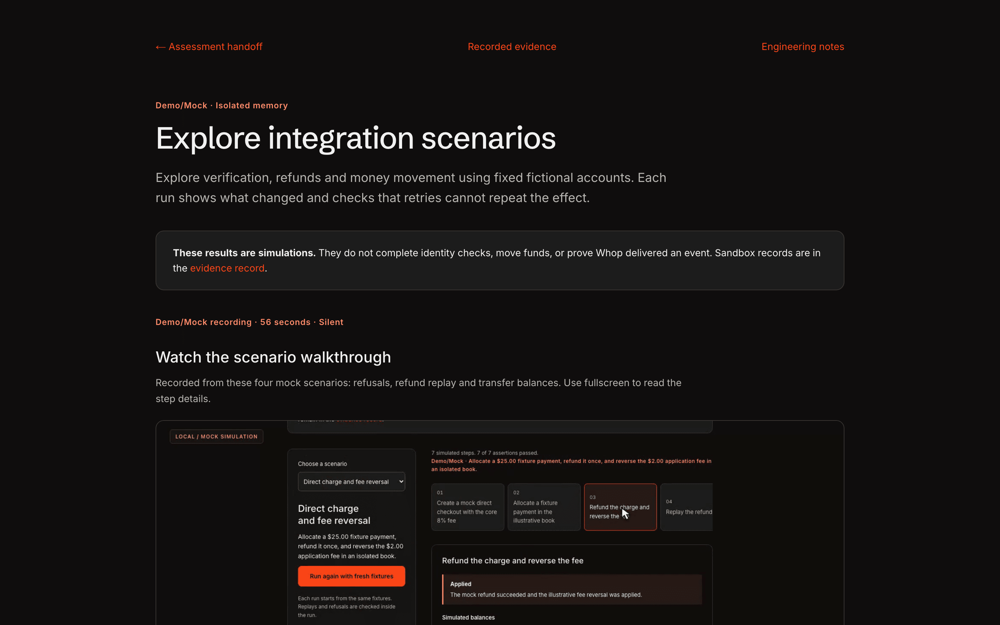

### A real Whop store

Ledgerly's products are also sold on Whop's own hosted store pages in the sandbox. Below: the store and one checkout.


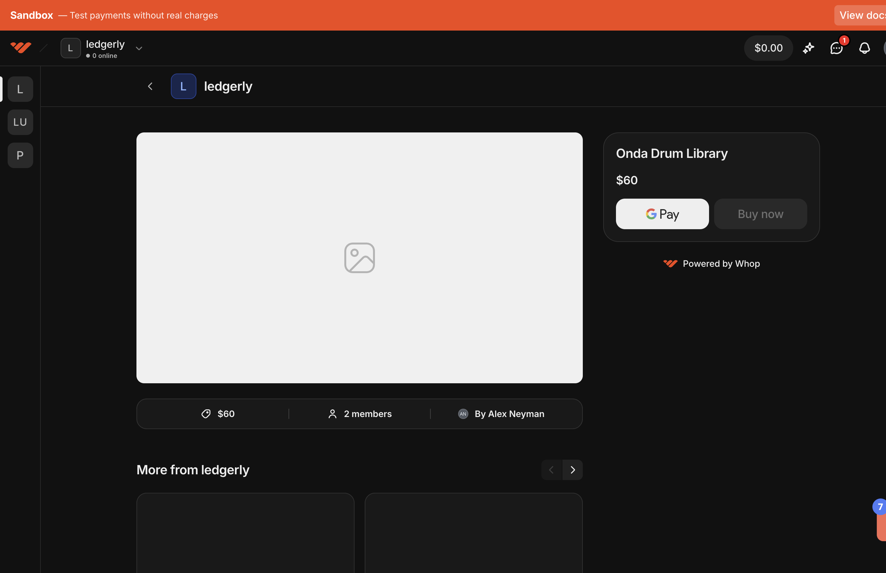

### Operator console and issue resolution

The operator sees every seller, the ledger with provider provenance on each row, and an issues queue. Detection compares the local ledger with Whop and files cases such as `missing_local_payment`, `unconfirmed_transfer` and `amount_mismatch`, each with its allowed actions and an audit trail.

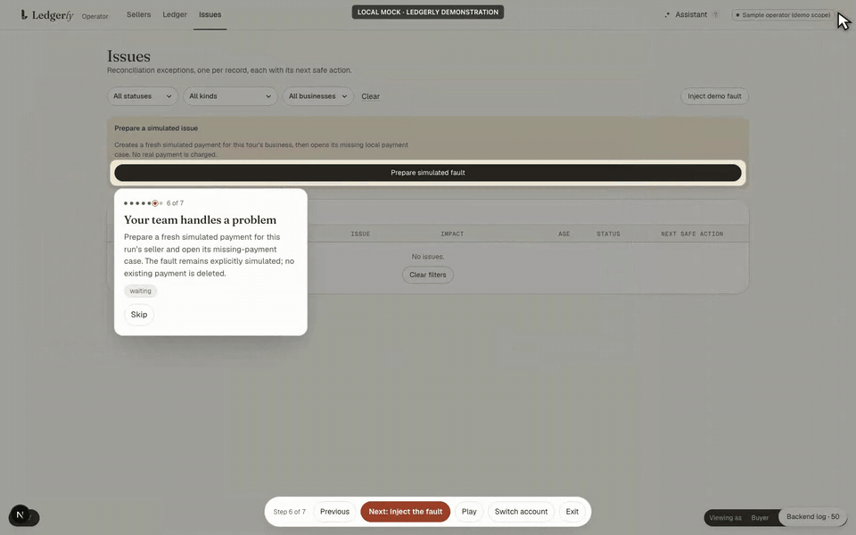

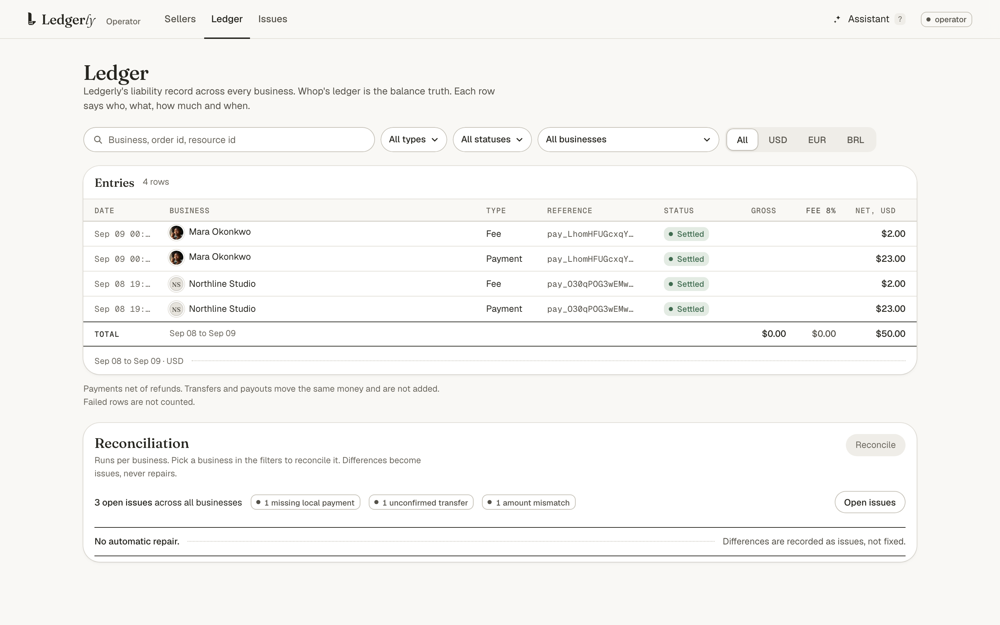

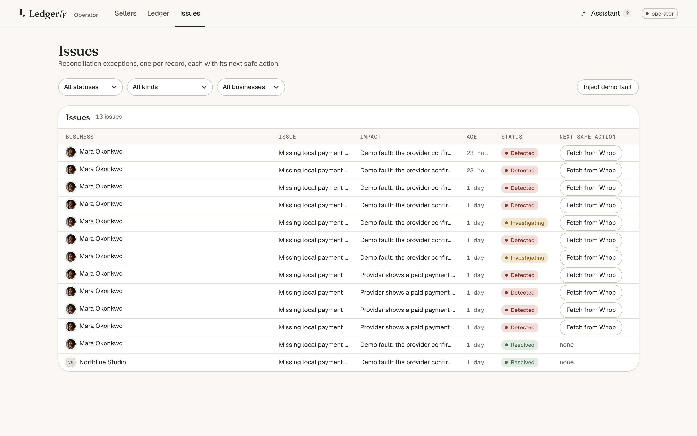

### Three provider modes

`WHOP_MODE=mock` answers from an in-memory adapter and needs no key. `sandbox` makes real calls and fails loudly where the sandbox cannot. `hybrid` reads the platform account's capabilities once, sends each operation to the sandbox when its capability is active and to the mock otherwise, and labels every result with its source. Routing table: [packages/whop/src/hybrid-adapter.ts](packages/whop/src/hybrid-adapter.ts).

### Reconciliation by hand

```sh
pnpm reconcile --seller biz_pt7b2NAryKwRGh --json
pnpm reconcile --mock
```

Pages through the seller's payments and transfers at Whop, compares them with the local ledger, and prints what is missing locally, missing at Whop, mismatched, or still pending. It writes nothing.

## Run it

```sh
pnpm install --frozen-lockfile
cp .env.example apps/web/.env.local
pnpm db:migrate
pnpm dev
```

| Variable | Purpose |
|---|---|
| `DATABASE_URL`, `BETTER_AUTH_SECRET`, `BETTER_AUTH_URL`, `APP_BASE_URL` | Postgres, session signing, app origin |
| `WHOP_MODE` | `mock` (default, no key), `sandbox`, or `hybrid` |
| `WHOP_API_BASE`, `WHOP_API_VERSION_DATE` | `https://sandbox-api.whop.com/api/v1` and the pinned version date |
| `WHOP_API_KEY`, `WHOP_PLATFORM_ACCOUNT_ID`, `WHOP_WEBHOOK_SECRET` | Platform key, `biz_` id, Standard Webhooks secret |
| `CRON_SECRET` | Bearer for the inbox and transfer sweep at `/api/cron/sweep` |
| `ONBOARDING_RETURN_URL`, `ONBOARDING_REFRESH_URL` | HTTPS callbacks for hosted onboarding |
| `DEMO_MODE`, `RUN_ID`, `WHOP_DEMO_FALLBACK` | Seeded walkthrough, run identity, labelled mock fallback for sandbox-limited operations |

| Command | Checks |
|---|---|
| `pnpm test` | Every package's suite, about 1,900 tests |
| `pnpm typecheck` | Workspace TypeScript |
| `pnpm lint` | Biome |
| `DEMO_MODE=1 WHOP_MODE=mock pnpm build` | Production build without a provider |
| `pnpm verify:docs` | Links, requirement manifest, source hashes |

The browser suites on main are red today: the guided tour's Next control and several operator and refund journeys fail in CI. Unit and contract tests, typecheck, build and the docs verifier pass.

Layout: `apps/web` is the Next.js app with routes, webhook and cron handlers. `packages/core` holds money, fees, onboarding, orders, inbox, transfers and reconciliation as pure services. `packages/whop` holds the mock, sandbox and hybrid adapters and webhook verification. `packages/db` holds the Drizzle schema and repositories. `docs` holds the brief, the pinned Whop docs, the answers and the evidence.

## What the sandbox could not do

- Approve the German seller. Sumsub's liveness step needs a live webcam; the sandbox has no test path. The account stays at `verification.individual: pending`. Only a person with a webcam can finish it.
- Pay out. Whop's sandbox guide lists payouts as unavailable. Payout and payout-method lists answer 200 and empty, so the embedded widget shows the balance with no method to withdraw to.
- Top up. `POST /topups` answers 404 "This PaymentToken was not found"; the dashboard deposit dialog answers 500. The midnight UTC settlement funded the transfer instead.
- Create a per-seller API key through the API. `POST /api_keys` answers 403. The key was made in the seller's dashboard.
- Run on a minimum-scope key. A custom-scoped platform key exists and passes every read and the access-token mint. Five statements are still missing, for account links, fee markups, disputes, transfer recipients and checkout creation; see [scoped-key-scopes.md](docs/lanes/final-closeout/keys/scoped-key-scopes.md). The app runs on the original key until they are added.
- Release platform transfers with the business id as origin. The sandbox answers "You cannot transfer funds out of your pending balance" even after settlement, and accepts the ledger account id. The sweep now sends the ledger id. After that deploy it released two queued orders on production, `ctt_oNcoiIUUlOoY8r` and `ctt_6yTMeiA636ESa5`; the rest wait for pending funds to settle.
